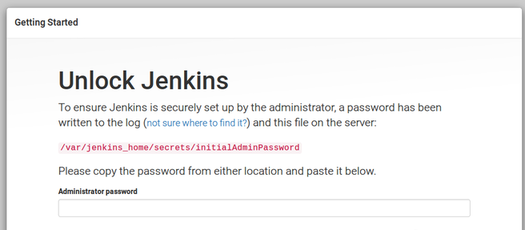
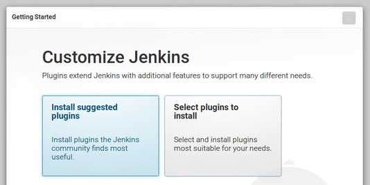
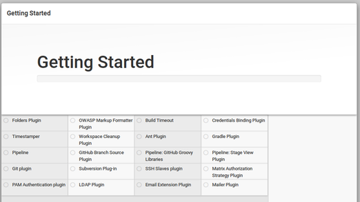
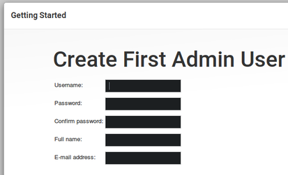
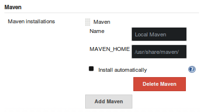
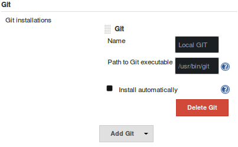

# Jenkins Docker Image 

Next to this file there is a a [Dockerfile](./Dockerfile) that creates a Jenkins Docker image with maven preloaded running on JDK 8.

## HOWTO's
1. **Build image:** Replace `"X.X.X"` by the desired version; remember to set the variables in an *"autosource-able"* file as `/etc/environment` if this is a production or stable environment.

        #Immage version replaces X.X.X 
        export JNKNS_IMG_VER=0.0.1
        docker build -t ordiel/jenkins:$JNKNS_IMG_VER .

2. **Start a Docker *"daemon"*;** 
	This the next steps guarantee the most stable and maintainable configuration since it allows the easiest debugging, backup and recovery/restart. The next describes the developer configuration, and needs to be tunned for a production environment. i.e: Here the data for this *daemon* will be stored in the `~/docker-data/jenkins`; instead if that were a production environment it should probably be stored under `/var/jenkins-data` where `/var` might be a `mount`'ed directory to a larger data volume from which it would be easier to back up and maintain as any other raw data.
	
	The environment variables that are suggested to be set up here wont be stored anywhere, again, this is more designed to a development environment, if this is a production environment they should probably be stored under `/etc/environment`

    1. Set up an environment variable to indicate where should the Jenkins data be stored for posterity.

            mkdir -p ~/docker-data/jenkins-data
            export JENKINS_DATA=~/docker-data/jenkins-data

    2. Set up desired image version

            #Image version replaces X.X.X 
            export JNKNS_IMG_VER=0.0.1
 
    3. Set up desired image version

            #Jenkins daemon container name 
            export JNKNS_CNTNR_NM=Jenkins
    
    4. Set up location of maven Jenkins repository data to prevent having to download every artifact again upon reset/restart
     
            #Jenkins daemon container name 
            export JENKINS_MVN_REPO=/root/.m2/repository/

    5. In this step you can also remap the ports being left the local port and right the docker one
    
            #Here you can also remap the ports as dessired
            docker run -d --name $JNKNS_CNTNR_NM \
            -p 8080:8080 \
            -p 50000:50000 \
            -v $JENKINS_DATA:/var/jenkins_home \
            -v $JENKINS_MVN_REPO:/root/.m2/repository/
            --restart always \
            ordiel/jenkins:$JNKNS_IMG_VER
            
3. **Obtain `initialAdminPassword`**
	If your instance is up and running and its not being too long (~30 min.) since you first start it simply execute.
	
	    # For a named container (as set up above)
	    docker logs $JNKNS_CNTNR_NM 2>&1 | grep -B 2 "This may also be found at: /var/jenkins_home/secrets/initialAdminPassword"

	Or
	
        docker ps
	
	And get the Jenkins container id, then:
	
        docker logs <<CONTAINER_ID>> 2>&1 | grep -B 2 "This may also be found at: /var/jenkins_home/secrets/initialAdminPassword"
	
## Jenkins initial Set Up

The first Jenkins screen requires the `initialAdminPassword` (read **HOWTO's**)

Provide the password to proceed to the next window; There select **Install Selected Plugins**

Wait until it finishes

Create the admin user and properly store its password

---

**Done!!! Congratulations, your Jenkins instance is up and running**

---

### Set Up Maven

On the main screen go to **Manage Jenkins** then **Global Tool Configuration** search for the **Maven** section and click on **Add Maven**, uncheck the **Install automatically** and set the **MAVEN_HOME** to be `/usr/share/maven/` and name it as `Local Maven`. Save

### Set Up Git
On the main screen go to **Manage Jenkins** then **Global Tool Configuration** search for the **Git** uncheck the **Install automatically** and set the **Path to Git executable** to be `/usr/bin/git` and name it as `Local Git`. Save

### Set Up Branding

**TIP:** Use the check boxes to remember on which step were you on after the coffee break but remember they are not persistent and will be lost over page reload.
 
Starting main screen:

1. [ ] On the left pane click **Manage Jenkins** then go to **Manage Plugins** select the **Installed**  tab
2. [ ] Search for the *`Simple Theme Plugin`*. Otherwise:
    1. [ ] Go to the tab **Available**
    2. [ ] Search for the *`Simple Theme Plugin`*
    3. [ ] Check the box next to it
    4. [ ] In the bottom of the screen click **Install without restart**
    5. [ ] On the next screen check the box **Restart Jenkins when installation is complete and no jobs are running** (this forces the restart once its safe to do so) 
3. [ ] Go back to **Manage Jenkins**
4. [ ] Then select **Configure System**
5. [ ] Scroll down to the **Theme** section
6. [ ] Under **URL of the theme CSS** set the value `http://localhost:8080/userContent/layout/jenkins-material-theme.css`
7. [ ] Go to the bottom of the screen and **Save**